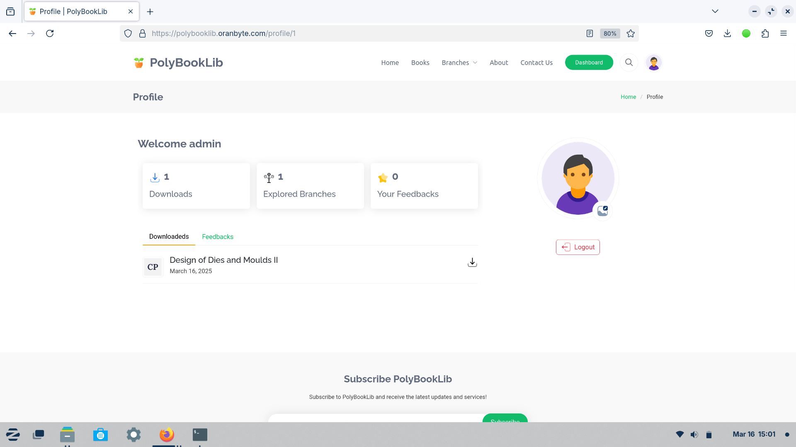

<!-- <p align="center"><a href="https://laravel.com" target="_blank"></a></p> -->
    
#  Poly-Book-Lib

<!-- // composer require tightenco/ziggy


// for showing pdf first page

```sh
composer require phpoffice/phpword
sudo apt-get install imagemagick        # on server for imagemagicks
sudo apt-get install php-imagick


# add extension to php.ini
extension=imagick.so
sudo apt install libmagickwand-dev
```

[Icons Link](https://icons8.com/icons/set/poly) -->

PolyBookLib an hobby project created for book download. Someone got this idea when struggling to get books. [Click here to view a live demo](https://polybooklib.oranbyte.com/)


## 🥏 Technolgies Used 
  1. PHP (8.2) 
  2. Laravel 10
        - ziggy
        - socialite
        - phpoffice/phpword
        - razorpay
        - tinker
        - guzzle
  3. MySQL database  
  4. Bootstrap 5
  5. JQuery, JavaScript
  6. HTML, CSS

## 💡 FEATURES 

- Semester Creation
- Branch Creation
- Book Creation
- File Creation
- User Login, Registration
- Socila Media Login Support - Google , Github, Facebook
- Razorpay payment gateway
- Reporting on admin : 
    - Downloads
    - Reviews
    - Users
    - Transactions
    - Subscribers
    - Contacts
- Dynamic Settings Of website by admin
- Searching on web and admin

explore even more and more...


### WebSite
<div style="display: flex;flex-direction: column; grid-gap: 10px;">
   <div style="display: flex; grid-gap: 10px;">
        
        
    </div>
   <div style="display: flex; grid-gap: 10px;">
        
        
    </div>
     <div style="display: flex; grid-gap: 10px;">
        
        
    </div>
     <div style="display: flex; grid-gap: 10px;">
        
        
    </div>
     <div style="display: flex; grid-gap: 10px;">
        
        
    </div>
</div>
<br>


### Admiin Dashboard
<div style="display: flex;flex-direction: column; grid-gap: 10px;">
   <div style="display: flex; grid-gap: 10px;">
        
        
    </div>
   <div style="display: flex; grid-gap: 10px;">
        
        
    </div>
     <div style="display: flex; grid-gap: 10px;">
        
        
    </div>
     <div style="display: flex; grid-gap: 10px;">
        
        
    </div>
     <div style="display: flex; grid-gap: 10px;">
        
        
    </div>
</div>
<br>

## HOW TO USE?


 Step-1: **[Install Composer](https://getcomposer.org/)** <br>
 Step-2: **[Install PHP and MySQL OR simply xampp](https://www.apachefriends.org/download.html)**<br>
 Step-3: open XAMPP start Apache server and MySQL database<br>
 Step-4: create database called <b>'polybooklib'</b> : open browser -> search -> <b>'localhost/phpmyadmin'</b> -> new -> under the database name type <b>'polybooklib'</b> -> create<br>

Installation

    Clone the Repo:
    > git clone https://github.com/suraj-repositories/Poly-book-lib.git
    > cd Poly-book-lib
    > composer install or composer update
    > cp .env.example .env
    > Set up .env file
    > php artisan key:generate
    > php artisan storage:link
    > php artisan migrate:fresh --seed
    > php artisan db:seed
    > php artisan serve
    http://127.0.0.1:8000/

<br>
setup your .env file correctly it contains database credentials - you can use `.env.example` for example of my .env


## Contributing

Pull requests are welcome. For major changes, please open an issue first
to discuss what you would like to change.

Please make sure to update tests as appropriate.

